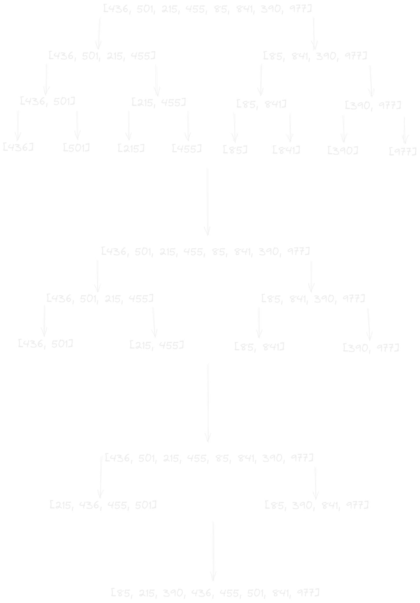
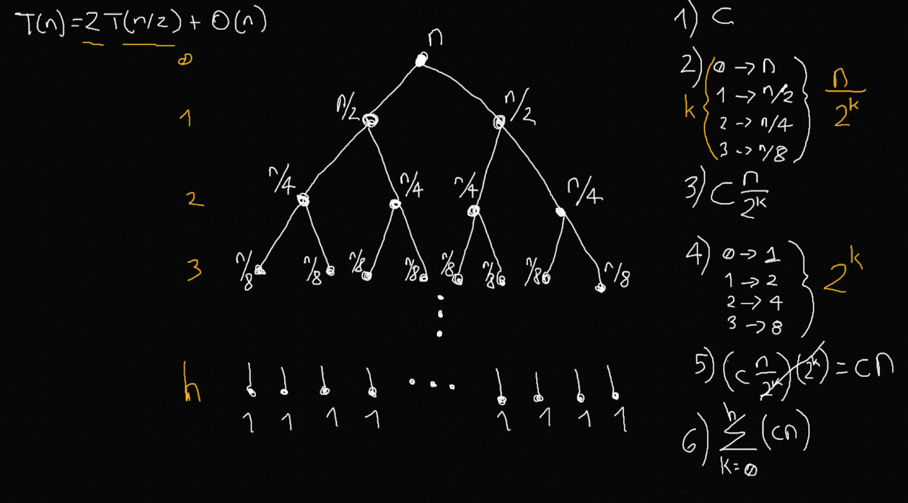
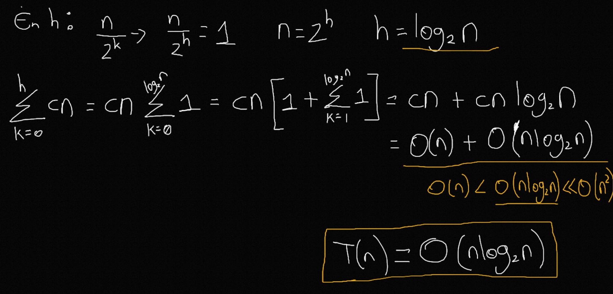
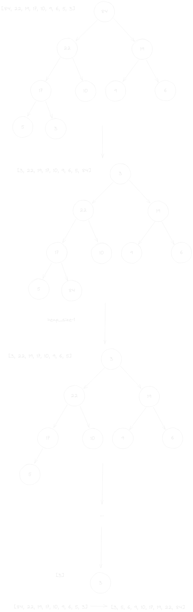
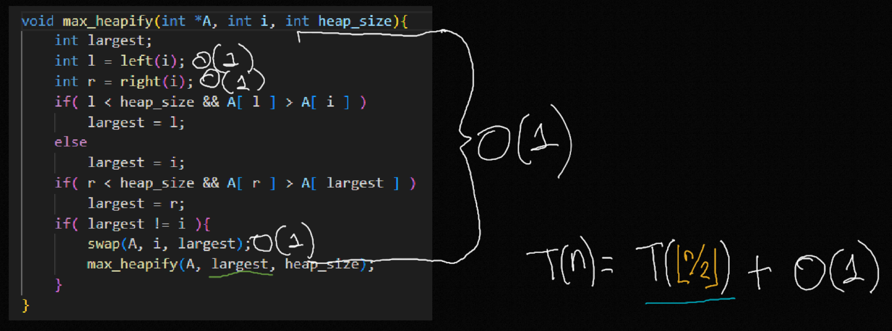
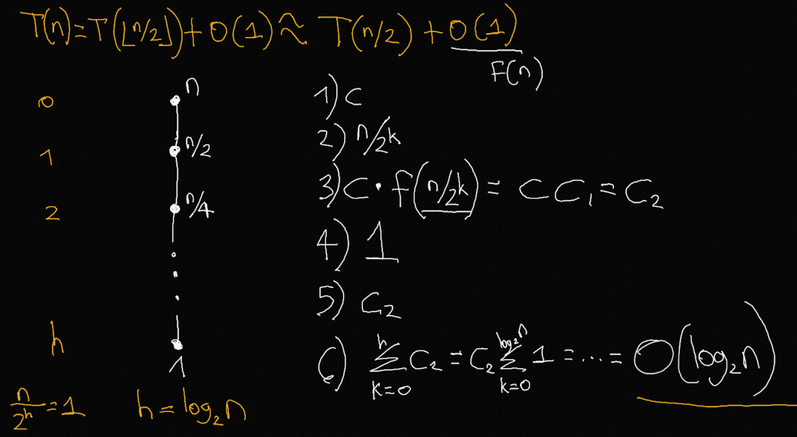
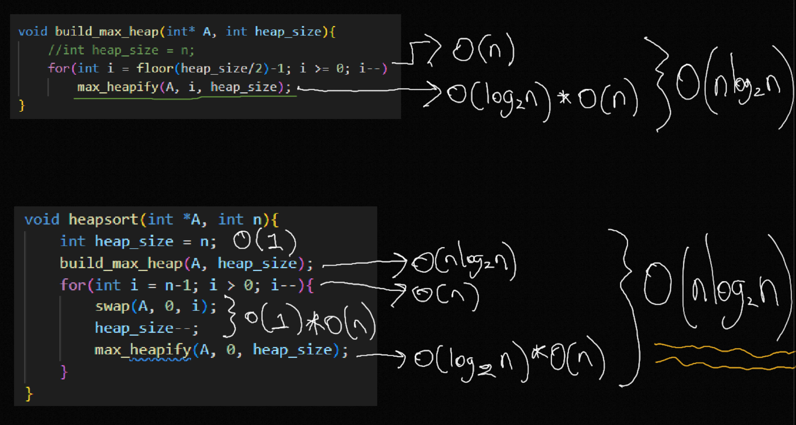
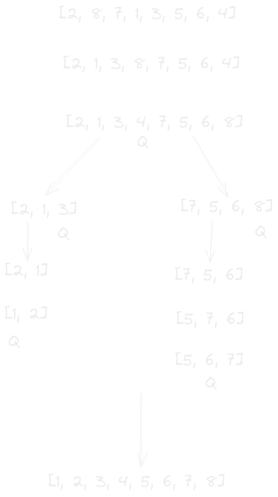
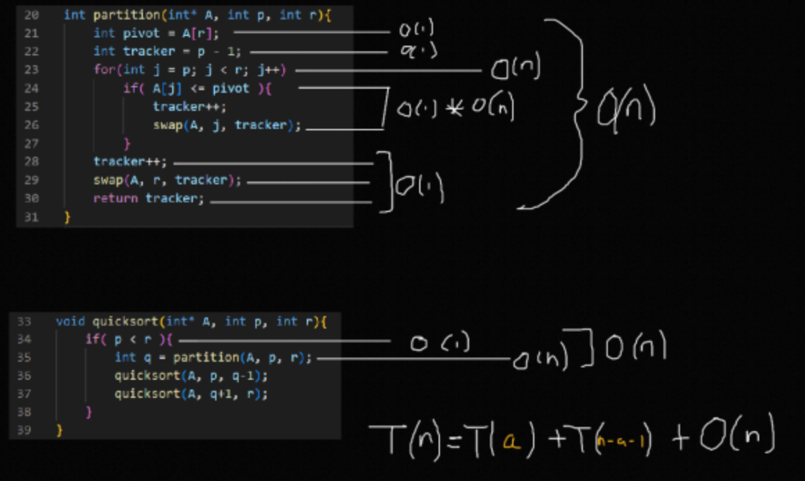
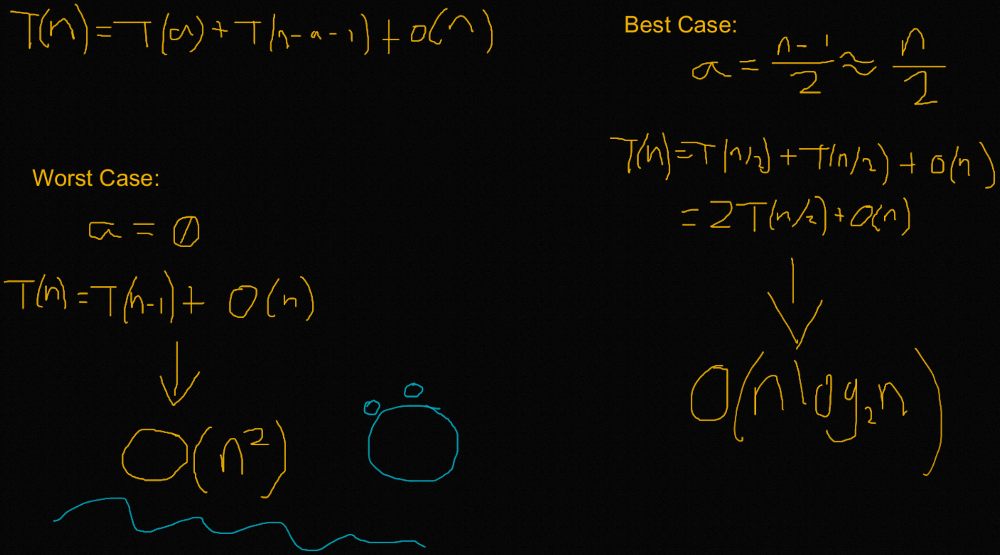

# Analisis de Algoritmos repaso parcial 2

# Algoritmos
# Merge sort

## Merge sort ascendente
Merge sort es un algoritmo el cual busca segmentar un arreglo de datos original en una serie de subarreglos partiendo del arreglo original, buscando la mitad, y generando una subseccion izquierda y una derecha, con al intencion de generar subrutinas para optimizar los recursos.

#

## Deconstruyendo cada funcion

### main()
En la funcion main() se declarara un arreglo de datos dependiente de n, pasandose como argumento a la funcion merge_sort()
```c++
int main()
{
    // Array size
    int n = 8;
    // Data array
    int A[n] = {5, 2, 4, 7, 1, 3, 2, 6};

    // First merge sort algorithm callback, with p=0, r=n-1
    merge_sort(A, 0, n - 1);

    show_array(A, n);

    return 0;
}
```

### merge_sort(int *A, int p, int r)
La funcion merge_sort(), dados los indices superior e inferior de una seccion de una arreglo, mientras no sean iguales, se genera un indice que divide en dos partes con la formula $floor({p+r}) \over 2$, el cual genera un dato partiendo de la suma de ambos indices, aproximado al entero menor, dividido entre 2, ejecutandose recursivamente, segmentando en subsecciones al arreglo original hasta generar subsecciones de longitud n.
```c++
// With A as the full array as reference, p as first index and r as last index
void merge_sort(int *A, int p, int r)
{
    // As long as p is lower than r, a double recursive call will be made
    if (p < r)
    {
        // With q as the half way index of the array, cutting it in half
        int q = floor((p + r) / 2);

        // Double recursive call

        // Using q instead of r to cut the first half
        merge_sort(A, p, q);
        // using q+1 instead of p to cut the second half
        merge_sort(A, q + 1, r);
        // Merge alhoritm callback, sending an array(A), first index(p), half index(q) and last index(r) of subsection
        merge(A, p, q, r);
    }
}
```

### merge(int *A, int p, int q, int r)
La funcion merge() genera subarreglos a partir de las subsecciones generadas por merge_sort(), creando un elemento adicional en cada subarreglo, que tomara el valor del mayor entero calculable por el procesador, generando una comparativa entre ambos subarreglos(L, R), aumentando progresivamente el indicie del menor en cada comparacion, hasta llegar al final del arreglo auxiliar en uso.
```c++
// Merge algorithm, receiving a full array(A), first index(p), half index(q) and last index(r) of each subsection
void merge(int *A, int p, int q, int r)
{
    // Declaring i and auxiliar indexes
    int i, j;
    // Declaring n1, known as the length of the left most part of the subsection
    int n1 = q - p + 1;
    // Declaring n2, known as the lenth of the right most part of the subsection
    int n2 = r - q;
    // Declaring L and R, subarrays that will store the data of the subsections, +1 extra element
    int L[n1 + 1], R[n2 + 1];

    // Filling Left subarray with the data of A argument, form 0 to n1, left most part
    for (i = 0; i < n1; i++)
        // Using data from array starting from p+i index, with p being first index
        L[i] = A[p + i];
    // Filling right subarray with the data of A argument, form 0 to n2, right most part
    for (j = 0; j < n2; j++)
        // Using data from array starting from q+1+j index, with q+1 being the half index
        R[j] = A[q + 1 + j];

    // Assigning the max capable number of the computer to last index of L and R subarrays
    L[n1] = INT_MAX;
    R[n2] = INT_MAX;

    // Reusing i and j indexes, assigning values back to 0
    i = j = 0;

    // For loop starting in p, ending in r, used for comparing both sides of the subarrays L and R
    for (int k = p; k <= r; k++)
        // if left subarray is bigger than right, the original array changes its k element for the L elements, stopping in last element of subarray
        if (L[i] < R[j])
        {
            A[k] = L[i];
            i++;
        }
        // if right subarray is bigger than left, the original array changes its k element for the R elements, stopping in last element of subarray
        else
        {
            A[k] = R[j];
            j++;
        }
}
```

### Ejemplo de resultado


## Analisis matematico

### Analizando merge()
Dado que existen 3 bucles for al mismo nivel, sin ninguna dependencia entre si ni proceso anidado, se concluye que merge() es $O(n)$.
```c++
void merge(int *A, int p, int q, int r)
{
    int i, j;
    int n1 = q - p + 1;
    int n2 = r - q;
    int L[n1 + 1], R[n2 + 1];
    for (i = 0; i < n1; i++)
        L[i] = A[p + i];
    for (j = 0; j < n2; j++)
        R[j] = A[q + 1 + j];
    L[n1] = INT_MAX;
    R[n2] = INT_MAX;
    i = j = 0;
    for (int k = p; k <= r; k++)
        if (L[i] < R[j])
        {
            A[k] = L[i];
            i++;
        }
        else
        {
            A[k] = R[j];
            j++;
        }
}
```

### Analizando merge_sort()
Dado que merge() es $O(n)$, concluimos que el resto de la funcion sin incluir la recurrencia es $O(n)$.
###
Valor de la primera llamada recursiva, $T(n)=T({n\over2})$
###
Valor de la segunda llamada recursiva, $T(n)=T({n\over2})$
###
Por lo tanto, la $T(n)$ de merge_sort() se define como $T(n)=2T({n\over2})+O(n)$
```c++
void merge_sort(int *A, int p, int r)
{
    if (p < r)
    {
        int q = floor((p + r) / 2);
        merge_sort(A, p, q);
        merge_sort(A, q + 1, r);
        merge(A, p, q, r);
    }
}
```
# PENDIENTE



#

# Heap sort

## Max heap sort
Max heap sort trabaja con un arreglo de datos, comparando un elemento $i = {n\over2}-1$ elemento con los elementos $2*i+1$ como nodo izquierdo y $2*i+2$ como nodo derecho, realizando comparaciones para encontrar el mayor de los 3 y desplazandolo mas cerca del inicio del arbol, una vez encontrado el mayor elemento de esa iteracion, se intercambia por el ultimo elemento del arreglo, se reserva, y se ejecuta de nuevo con un indice reducido en 1 hasta terminar las iteraciones.

#

## Deconstruyendo cada funcion

### Main()
En la funcion main() se declarara un arreglo de datos dependiente de n, pasandose como argumento a la funcion heapsort()
```c++
int main()
{
    // Array size
    int n = 9;
    // Data array
    int A[n] = {5, 13, 2, 25, 7, 17, 20, 8, 4};

    // Heapsort root function call
    heapsort(A, n);

    show_array(A, n);

    return 0;
}
```

### heapsort(int *A, int n)
En la funcion heapsort() es donde se ejecutaran los algoritmos, orden y reordenamiento del arreglo por medio de llamadas a funciones, se redeclarara el tamaño del arreglo para su uso posterior en la llamada de max_heapify() al momento de ordenar el arreglo, se podria definir como la funcion principal de heap sort.
```c++
// Root heapsort function, receiving an array and array size
void heapsort(int *A, int n)
{
    // Declaring heapsize from n
    int heap_size = n;

    // BuildMaxHeap function callback
    build_max_heap(A, heap_size);

    // For loop that starts from the last index to 1
    for (int i = n - 1; i > 0; i--)
    {
        // Swapping 0 and each of the elements of the array
        swap(A, 0, i);
        // Reducing the heap size, so maxHeapify can work with smaller data until it runs out, checking each element
        heap_size--;
        max_heapify(A, 0, heap_size);
    }
}
```

### build_max_heap(int *A, int heap_size)
En la funcion build_max_heap() se genera un bucle el cual dependera de $floor(heap_size / 2) - 1$, esto encontrara el indice del ultimo nodo con hojas, y a partir de el ira subiendo en el arreglo hasta llegar al indice 0, llamando a la funcion max_heapify(), enviando un indice menor cada vez.
```c++
// BuildMaxHeap function, receiving an array and size
void build_max_heap(int *A, int heap_size)
{
    // int heap_size = n;

    // For loop from the floor of size/2 - 1
    for (int i = floor(heap_size / 2) - 1; i >= 0; i--)
        // Executing max heap sort from the floor of size/2 -1 to 0, going backwards in the array, passing Array(A), an index(i) and the size of the array(heap-size)
        max_heapify(A, i, heap_size);
}
```

### max_heapify(int *A, int i, int heap_size)
En la funcion max_heapify() es donde el algoritmo en si es implementado, la forma en que max_heapify() funciona es que dado un indice que representa una rama de un arbol, evalua a la rama con respecto a las hojas del mismo, buscando al mayor de los 3 e intercambiandolo por la rama de ser necesario, en caso de que exista un intercambio de nodos, es necesario hacer una llamada recursiva al nodo cambiado, tomando a ese mismo como padre y ejecutando los mismos cambios en caso de ser necesario, si no es necesario, el ultimo elemento del arbol se intercambiaria con el primero, dejando al elemento mayor al final del arreglo reservado, disminuyendo en 1 el tamaño del arreglo a iterar y volviendose a ejecutar, asi sucesivamente hasta terminar las iteraciones posibles.
```c++
// Max heapify algoritm, receives an array(A), an index(i) and the size of the array(heap_size)
void max_heapify(int *A, int i, int heap_size)
{
    // Declaring the largest variable
    int largest;
    // Declaring and assigning l and r from left and right functions, using the index as a parameter
    int l = left(i);
    int r = right(i);

    // As long as the left index is smaller than the array size and if the l index of the array is bigger than i index of the array
    if (l < heap_size && A[l] > A[i])
        // Define the left node as the largest
        largest = l;
    else
        // Keep the parent node as the largest
        largest = i;

    // As long as the right index is smaller than the array size and if the r index of the array is bigger than the "largest" variable index of the array
    if (r < heap_size && A[r] > A[largest])
        // Define the right node as the largest
        largest = r;

    // If the largest element is different than the original parent node, call swap function and do a recursive call on the swapped node
    if (largest != i)
    {
        swap(A, i, largest);
        max_heapify(A, largest, heap_size);
    }
}
```

### left(int i)
la funcion left() encontrara el nodo hijo izquierdo del elemento padre que se esta evaluando en max_heapify(), utilizando la formula $2*i+1$, avanzando en los indices hasta llegar al indice del hijo izquierdo.
```c++
// Left function, receives an index
int left(int i)
{
    // Returns the left child of current node, based on the position from the array
    return 2 * i + 1;
}
```

### right(int i)
la funcion right() encontrara el nodo hijo derecho del elemento padre que se esta evaluando en max_heapify(), utilizando la formula $2*i+2$, avanzando en los indices hasta llegar al indice del hijo derecho.
```c++
// Right function, receives an index
int right(int i)
{
    // Returns the right child of current node, based on the position from the array
    return 2 * i + 2;
}
```

### swap(int *A, int i, int j)
La funcion swap() se encarga de intercambiar los elementos dados dos indices de un arreglo.
```c++
// Swap function, receives an array and two indexes to swap using a temp variable(i, j)
void swap(int *A, int i, int j)
{
    int temp = A[i];
    A[i] = A[j];
    A[j] = temp;
}
```

### Ejemplo de resultado


#

## Min heap sort
La funcion Min heap sort funciona de una forma igual que max, con la diferencia que intenta ordenar un arreglo de manera descendente en lugar de ascendente, para ello es necesaria una pequeña modificacion en la funcion max_heapify(), convirtiendola a min_heapify() de la siguiente manera.
```c++
// Min heapify algoritm, receives an array(A), an index(i) and the size of the array(heap_size)
void min_heapify(int *A, int i, int heap_size)
{
    // Declaring the smallest variable
    int smallest;
    // Declaring and assigning l and r from left and right functions, using the index as a parameter
    int l = left(i);
    int r = right(i);

    // As long as the left index is smaller than the array size and if the l index of the array is smaller than i index of the array
    if (l < heap_size && A[l] < A[i])
        // Define the left node as the smallest
        smallest = l;
    else
        // Keep the parent node as the smallest
        smallest = i;

    // As long as the right index is smaller than the array size and if the r index of the array is smaller than the "smallest" variable index of the array
    if (r < heap_size && A[r] < A[smallest])
        // Define the right node as the largest
        smallest = r;

    // If the smallest element is different than the original parent node, call swap function and do a recursive call on the swapped node
    if (smallest != i)
    {
        swap(A, i, smallest);
        max_heapify(A, smallest, heap_size);
    }
}
```

## Analisis matematico

# PENDIENTE

### Analizando max_heapify()



```c++
void max_heapify(int *A, int i, int heap_size)
{
    int largest;
    int l = left(i);
    int r = right(i);
    if (l < heap_size && A[l] > A[i])
        largest = l;
    else
        largest = i;
    if (r < heap_size && A[r] > A[largest])
        largest = r;
    if (largest != i)
    {
        swap(A, i, largest);
        max_heapify(A, largest, heap_size);
    }
}
```

### Analizando build_max_heap()

```c++
void build_max_heap(int *A, int heap_size)
{
    for (int i = floor(heap_size / 2) - 1; i >= 0; i--)
        max_heapify(A, i, heap_size);
}
```

### Analizando heapsort()


```c++
void heapsort(int *A, int n)
{
    int heap_size = n;
    build_max_heap(A, heap_size);
    for (int i = n - 1; i > 0; i--)
    {
        swap(A, 0, i);
        heap_size--;
        max_heapify(A, 0, heap_size);
    }
}
```

#

# Quick sort
Quick sort es una evolucion de merge sort, el cual se basa en el ultimo elemento del array en cada iteracion como pivote de comparacion, recorriendo los indices menores a el, buscando valores menores, mandandolos a la izquierda en caso de cumplirse la condicion, y en caso de encontrar valores mayores, se ubican a la derecha de los elementos a evaluar con respecto al pivote. El objetivo es dejar todos los elementos menores a la izquierda y todos los mayores a la derecha, intercambiando el pivote por el primer elemento mayor que el en el arreglo, tomando su posicion correcta.

#

## Deconstruyendo cada funcion

### main()
En la funcion main() se declarara un arreglo de datos dependiente de n, pasandose como argumento a la funcion quicksort()
```c++
int main()
{
    int n = 8;
    int A[n] = {2, 8, 7, 1, 3, 5, 6, 4};

    quicksort(A, 0, n - 1);

    show_array(A, n);

    return 0;
}
```

### quicksort(int *A, int p, int r)
Funcion principal de quicksort, es la encargada de hacer las llamadas recursivas dentro del algoritmo, dependiendo de los indices que se reciben, se comparan para entrar a un proceso recursivo.
```c++
// Main function for quicksort, receives an array(A), the first index(p) and last index(r) of that iteration
void quicksort(int *A, int p, int r)
{
    // if the first index is smaller than the last index
    if (p < r)
    {

        int q = partition(A, p, r);
        // Recursive call for left most section of the array based on q as the last index
        quicksort(A, p, q - 1);
        // Recursive call for right most section of the array based on q as the fisrt index
        quicksort(A, q + 1, r);
    }
}
```

### partition(int *A, int p, int r)
Es la funcion principal de quicksort, recibe un arreglo y dos indices(p, r), declara un pivote, el cual se utiliza en un bucle, recorriendo todo el arreglo en los elementos anteriores, utilizandolo como comparador con respecto a cada elemento, buscando valores menores a el,finalmente intercambiandose con el tracker. Dicho elemento es el indice menor recibido disminuido en 1, el cual sigue al primer elemento mayor en el array.
```c++
// Main quicksort algorithm, receives an array(A), the first index(p) and the last index(r) of that iteration
int partition(int *A, int p, int r)
{
    // Declare and define the pivot, it has to be the last element of the iteration(r)
    int pivot = A[r];
    // Declare and define the tracker, it is based on the first index of the callback
    int tracker = p - 1;

    // For loop that goes through the array from p to r
    for (int j = p; j < r; j++)
        // If the element in the for index is smaller than the pivot, the tracker increases in 1 and the element in the j index and the tracker index swap
        if (A[j] <= pivot)
        {
            tracker++;
            swap(A, j, tracker);
        }

    // The tracker gets increased by 1 and gets swapped with the last element of the iteration
    tracker++;
    swap(A, r, tracker);

    // Function returns the tracker for a recursive call
    return tracker;
}
```

### Ejemplo de resultado


## Analisis matematico

### Analizando partition()

```c++
int partition(int *A, int p, int r)
{
    int pivot = A[r];
    int tracker = p - 1;
    for (int j = p; j < r; j++)
        if (A[j] <= pivot)
        {
            tracker++;
            swap(A, j, tracker);
        }
    tracker++;
    swap(A, r, tracker);
    return tracker;
}
```

### Analizando quicksort()


```c++
void quicksort(int *A, int p, int r)
{
    if (p < r)
    {
        int q = partition(A, p, r);
        quicksort(A, p, q - 1);
        quicksort(A, q + 1, r);
    }
}
```


# Recurrencias

